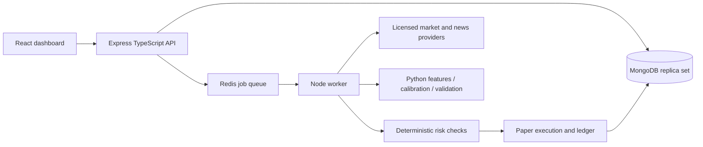

# AlphaSutra

Indian-market research and paper trading with a MERN application and a separate
Python quantitative service. This repository is under active implementation;
it is not a verified profitable strategy or a commercial launch approval.

## Architecture

MongoDB is suitable here because all accounting changes use replica-set
transactions, unique idempotency keys, bounded integer paise and owner-scoped
queries. A standalone MongoDB server is deliberately unsupported.

## Development

Requires Node 22+, Python 3.12+, MongoDB 7+ replica set and Redis 7+.
Copy `.env.example` to `.env`, install with `npm ci`, run
`npm run migrate -w @alphasutra/api`, then `npm run dev`.
The API starts only after migrations and replica-set readiness succeed.
All API mutation requests require an `Origin` matching `APP_ORIGIN`.

`npm test`, `npm run typecheck`, `npm run lint` and `npm run build` validate the
JavaScript application. Money inputs are paise: `10000` means ₹100.
Wallet mutations require a UUID `Idempotency-Key` header. Retry the same logical
operation with the same key and identical payload.

## Safety and boundaries

Each account begins with ₹10,00,000 of simulated capital. No real deposits,
withdrawals or broker orders are supported. Live trading configuration fails
closed. LLM outputs are interpretations of news, never execution authority.

No accuracy or return is guaranteed. A 90% win-rate aspiration must be tested
on an untouched chronological sample, with coverage, uncertainty and costs
reported. Sparse high-confidence signals are allowed to abstain.

Before selling research or deploying with live accounts, independently verify
SEBI obligations, broker requirements and market-data redistribution rights.
Free personal API access does not establish a right to redistribute data.
